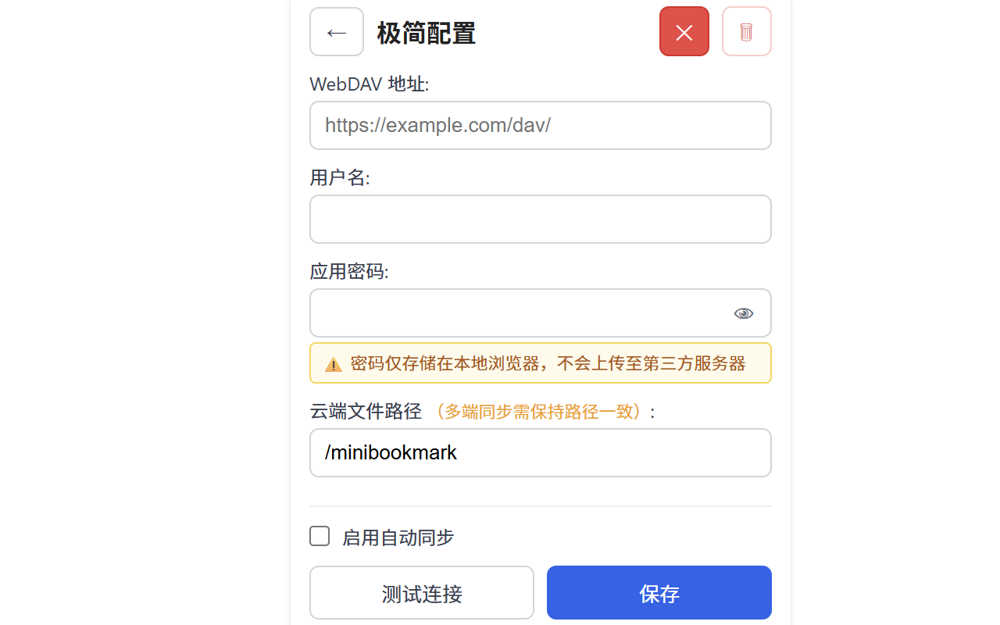
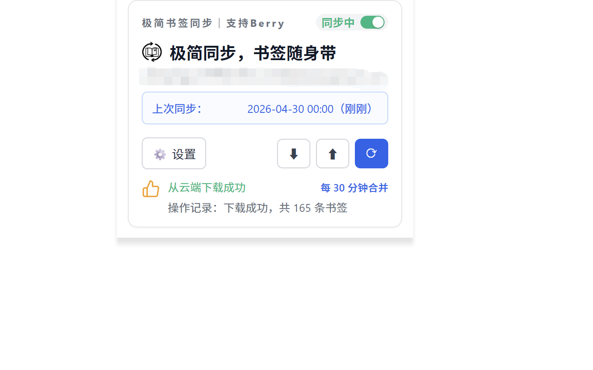
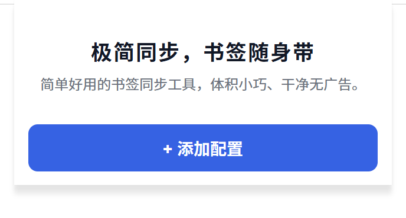

# 极简书签同步（维护版）

> 轻量、干净、无广告的书签同步工具，通过 WebDAV 协议将书签同步到你的私有云盘。
> 本仓库是 [原项目](https://github.com/jagshen/Mini-bookmark-sync) 的维护版：保留原项目的全部功能，
> 并补上手机端支持、双向增量增删，以及一批跨端同步的一致性修复。

[](https://github.com/xiaopeng66/Mini-bookmark-sync/releases)
[](LICENSE)

---

## ✨ 功能特色

- 🔄 **多模式同步** — 支持上传、下载、合并三种同步策略
- ⏰ **自动定时同步** — 可设置 5~1440 分钟自动同步间隔
- ☁️ **WebDAV 协议** — 兼容坚果云、Nextcloud、群晖等主流网盘
- 🔒 **数据安全** — 书签数据直连你的云盘，不经过第三方服务器
- 🛡️ **本地备份** — 导入前自动备份，防止意外丢失
- 🧹 **无广告无追踪** — 干净纯粹，没有任何多余功能
- 💾 **书签备份管理** — 支持创建、浏览、导入历史备份
- 📱 **隐私保护** — 完整的[隐私政策](https://jagshen.github.io/Mini-bookmark-sync/privacy.html)

## 🆕 本版新增（相比原项目）

- 📱 **手机端也能用** — 另外提供 Gecko 引擎浏览器（可拓 / 雨见等）的 MV2 安装包，手机与电脑可以互相同步
- 🔁 **双向增量增删** — 任一端删掉的书签，其他端下次同步跟着删；上传、下载、合并三条路径都生效
- 📂 **单同步桶** — 只同步一个文件夹（自动识别，设置页可改），「其他收藏夹」里的内容不再被备份或改动
- 📍 **下载写入位置可选** — 像 floccus 一样，在设置里整树任选一个文件夹接收云端内容
- 🧹 **「下载重建」更安全** — 清空只作用于同步文件夹，不再动同步文件夹之外的书签
- 💾 **配置导出 / 导入** — 换浏览器时导出配置文件再导入，不必重填 WebDAV
- ✅ **同步结果更诚实** — 写入失败、顺序没落到位都会如实报出来，不再一律显示「成功」
- 🩺 **后台诊断** — 设置页一键输出诊断报告，排查同步问题不用再靠猜

## 📸 界面预览

<table>
  <tr>
    <td align="center">
      <br/>
      <b>配置页面</b>
    </td>
    <td align="center">
      <br/>
      <b>主页</b>
    </td>
    <td align="center">
      <br/>
      <b>新增页面</b>
    </td>
  </tr>
</table>

## 🚀 快速开始

### 1. 安装扩展

到 [Releases](https://github.com/xiaopeng66/Mini-bookmark-sync/releases) 页下载对应安装包
（商店里在架的仍是原项目的旧版本，不含本版修复，建议用下面的旁加载包）：

| 你在用什么 | 装哪个 |
|---|---|
| 桌面 Edge / Chrome | `chromium-sideload.zip` — 解压后在 `edge://extensions`（Chrome 是 `chrome://extensions`）打开「开发人员模式」，点「加载已解压的扩展程序」选该文件夹 |
| 手机 可拓 / 雨见等 | `gecko-mv2-persistent.xpi` — 地址栏显示 `moz-extension://` 的就是 Gecko 引擎浏览器 |
| 手机 Firefox | `gecko-mv2.xpi` |

### 2. 配置 WebDAV

1. 点击扩展图标打开弹窗
2. 进入设置页面
3. 填写 WebDAV 服务器信息：

| 配置项 | 说明 | 示例 |
|--------|------|------|
| 服务器地址 | WebDAV 服务地址 | `https://dav.jianguoyun.com/dav/` |
| 用户名 | 网盘账号或应用专用密码用户名 | `your@email.com` |
| 密码 | 应用专用密码（非登录密码） | `xxxxxxxxxxxx` |
| 书签路径 | 云端书签存储路径 | `/书签同步/bookmarks.json` |

### 3. 开始同步

配置完成后，点击「合并」即可完成首次同步。

- **首次同步建议用「合并」**：两端内容会合到一起，不会互相覆盖
- **同步文件夹**默认自动识别，可在设置页改；「下载写入位置」可选云端内容落到本机哪个文件夹
- 三种模式都会带上删除记录，任一端删掉的书签下次同步会跟着删

## ☁️ 支持的 WebDAV 服务

| 服务 | 推荐度 | 备注 |
|------|--------|------|
| 坚果云 | ⭐⭐⭐ | 国内最常用，免费额度足够 |
| Nextcloud | ⭐⭐⭐ | 开源自建，完全可控 |
| 群晖 NAS | ⭐⭐⭐ | WebDAV Server 套件 |
| Teracloud | ⭐⭐ | 免费提供 WebDAV |
| 其他 WebDAV | ⭐ | 支持 RFC 4918 标准即可 |

> 💡 **坚果云用户**：需要在[第三方应用管理](https://www.jianguoyun.com/d/account/security)中创建应用密码，不能使用登录密码。

## 📖 同步模式说明

| 模式 | 说明 | 适用场景 |
|------|------|----------|
| **合并** | 两端书签增量增删，各自的新增与删除都在云端收敛 | 日常使用（默认） |
| **上传** | 以本机为准覆盖云端；云端删掉的会先从本机删掉，删除记录随文件带上云 | 以本机为准时使用 |
| **下载** | 云端新增的导入本机，云端删掉的也从本机删掉；本机独有的书签保留 | 以云端为准时使用 |

> 三种模式都按同一份「删除记录（墓碑）」判据做增量增删：任何一端删掉的书签，
> 只要同步过一次，其他端下次同步就会跟着删。删除记录不会因为「另一台机器很久没开机」
> 而被时间清掉——只有当所有机器都已经没有这条书签时，它才会被回收。

## 🛠️ 技术栈

- Chrome Extension Manifest V3（Chromium 系）/ MV2（Gecko 系宿主）
- 原生 JavaScript（无框架依赖）
- WebDAV 协议通信
- Chrome Storage API 本地存储

同一份源码出两种宿主形态，差异只在 manifest：Chromium 系用 `background.service_worker`，
Gecko 系用 `background.scripts`（Gecko 会直接拒绝 MV3 的 service worker，那种宿主上 MV3 包的后台从不运行）。

出包（脚本都在 `tools/`，产物写进 `dist/`）：

```
python tools/build_packages.py        # 一次产出 crx / chromium zip / mv2 xpi / mv2 常驻 xpi，并回读核验
python tools/stage_edge_unpacked.py   # 生成桌面「加载解压缩的扩展」用的 dist/edge-unpacked
```

签名私钥不入库，默认取 `build/minibm-signing.pem`（可用 `--key` 或环境变量 `MINIBM_PEM` 指定）；
没有私钥时 crx 会跳过，zip 与 xpi 照常产出。

## 📁 项目结构

```
Mini-bookmark-sync/
├── manifest.json          # 扩展配置
├── background.js          # 后台（同步引擎）
├── popup.html / popup.js  # 弹窗界面
├── options.html / options.js  # 设置页面
├── adapters/              # 手机端桥接（Berry / Via / Aira）
├── core/                  # 上传 / 下载 / 合并三条同步路径
├── lib/  model/           # 合并引擎、XBEL、删除记录
├── icons/  images/        # 扩展图标与界面图标
├── test/                  # vitest 测试
├── tools/                 # 出包与暂存脚本
└── docs/                  # 仓库文档资源（README 截图等，不进安装包）
```

## 🙏 感谢原项目

本项目的原始版本由 **[jagshen](https://github.com/jagshen)** 开发并开源：

- **原项目地址：<https://github.com/jagshen/Mini-bookmark-sync>**

极简书签同步的核心设计（单文件 WebDAV 直连、干净无广告的体验）都来自原项目，
本仓库只是在其基础上的维护分支。如果你觉得这个工具好用，欢迎去原项目点一个 ⭐。
原项目以 MIT 许可证开源，本分支沿用同一许可证，见 [LICENSE](LICENSE)。

## 📄 相关链接

- [隐私政策](https://jagshen.github.io/Mini-bookmark-sync/privacy.html)
- [支持与捐赠](https://jagshen.github.io/Mini-bookmark-sync/support.html)
- [问题反馈](https://github.com/xiaopeng66/Mini-bookmark-sync/issues)
- [原项目](https://github.com/jagshen/Mini-bookmark-sync)

## 📜 License

MIT License
